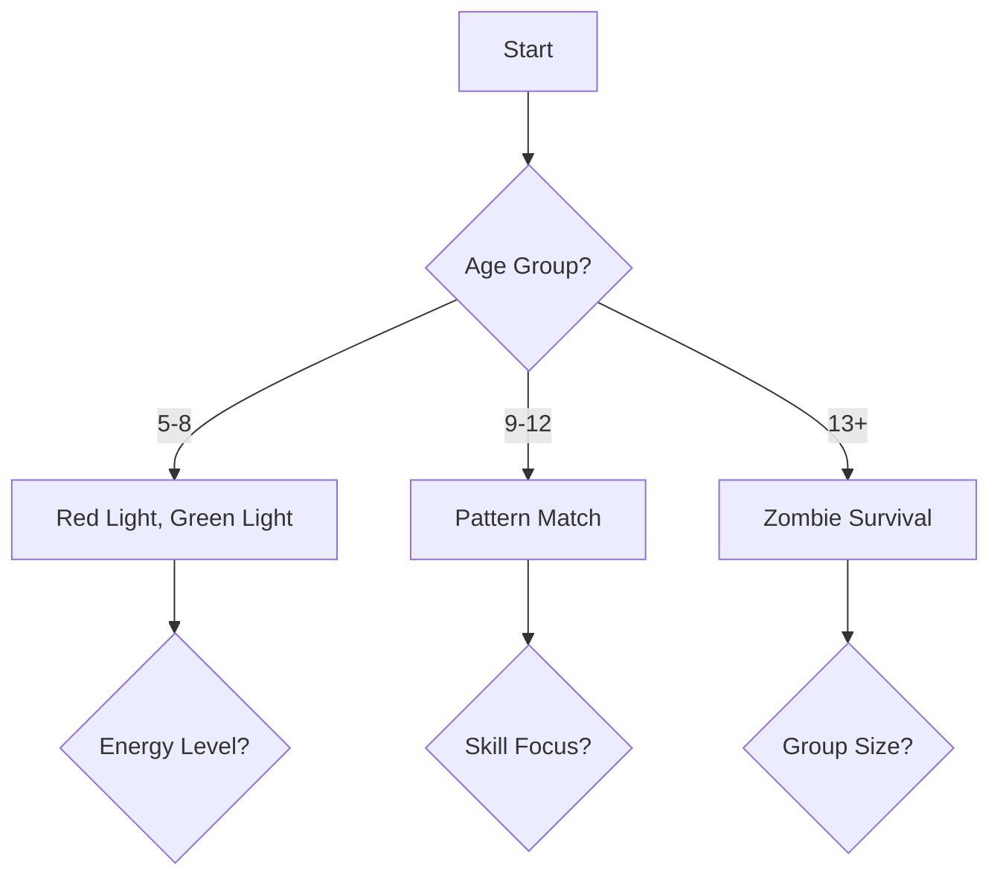

# ZTAG Knowledge Base

## 📚 Table of Contents
[Getting Started](#getting-started)
[System](#system) |
[Games](#games) |
[Operations](#operations) |
[Support](#support)

---

## Getting Started
### Quick Start Guide

#### Pre-Setup Checklist
- [ ] Clear space of 40x40 feet minimum
- [ ] Access to power outlet (110V)
- [ ] Stable tables or surfaces for equipment
- [ ] Proper lighting conditions
- [ ] Network connectivity verified

#### 1. System Setup (15-20 minutes)
1. **Equipment Unpacking**
   - Remove ZEUS Command Center from carrying case
   - Verify all components are present:
     * Main ZEUS unit
     * Power cables
     * 24 Ztagger units
     * Charging dock
     * Network router
     * Quick reference cards

2. **Physical Setup**
   - Place ZEUS on stable, flat surface
   - Ensure proper ventilation (6" clearance all sides)
   - Connect power supply
   - Arrange Ztaggers in charging dock
   - Position router within 10 feet of ZEUS

3. **System Initialization**
   - Press power button (hold 3 seconds)
   - Wait for boot sequence (3-5 minutes)
   - Verify screen display
   - Check wireless network connection
   - Test Ztagger connectivity

#### 2. First Game Setup (10-15 minutes)
1. **Game Selection**
   - Access main menu
   - Choose "Quick Start Game"
   - Select recommended first game:
     * "Red Light, Green Light" (beginners)
     * "Pattern Match" (intermediate)
     * "Keep Away" (advanced)

2. **Player Preparation**
   - Register number of players
   - Assign Ztagger units
   - Demonstrate proper wear:
     * Secure but not tight
     * Screen visible to player
     * Sensors unobstructed

3. **Game Configuration**
   - Set game duration (recommended: 5 minutes first round)
   - Configure difficulty level (start with "Easy")
   - Set up scoring system
   - Define play area boundaries

#### 3. Basic Operations (5-10 minutes)
1. **Essential Controls**
   - Start/Stop: Green/Red buttons
   - Pause: Yellow button
   - Emergency Stop: Hold red button 5 seconds
   - Volume Control: Side buttons
   - Brightness Adjustment: Settings menu

2. **Player Management**
   - Adding players mid-game
   - Removing players
   - Switching teams
   - Viewing scores
   - Managing rotations

3. **Common Commands**
   - Reset game: Home + Select
   - Switch modes: Menu + Select
   - Player status: Quick tap player ID
   - System status: Home button
   - Quick settings: Menu button

#### 4. Troubleshooting Basics
- **No Power**: Check connections and power button
- **No Display**: Adjust brightness, check cables
- **Ztagger Issues**: 
  * Check battery level
  * Verify proper wear
  * Reset device (hold button 10 seconds)
- **Connection Problems**:
  * Check Wi-Fi signal
  * Restart router if needed
  * Verify distances between units

#### 5. First Game Tips
- Start with shorter rounds (3-5 minutes)
- Use simple game modes first
- Ensure all players understand rules
- Monitor player engagement
- Keep spare batteries ready
- Have quick reference card handy

### About ZTAG

#### Company Overview
ZTAG is an innovative entertainment technology company specializing in interactive gaming systems for educational and recreational purposes. Founded with the vision of transforming traditional physical activities into engaging tech-enhanced experiences, ZTAG has become a leader in active gaming solutions.

#### Core Values
1. **Innovation in Play**: We believe in creating experiences that seamlessly blend technology with physical activity
2. **Educational Impact**: Committed to making learning an engaging and active experience
3. **Safety First**: Ensuring all our products and experiences prioritize user safety
4. **Inclusive Design**: Creating products that are accessible and enjoyable for all ages and abilities
5. **Quality Excellence**: Maintaining high standards in both hardware and software development
6. **Customer Success**: Dedicated to supporting our customers' goals and achievements

#### Core Focus
- **Mission**: To revolutionize active play through innovative technology, making learning and exercise naturally enjoyable
- **Vision**: To be the global leader in tech-enhanced active gaming solutions
- **Target Markets**:
  * Educational Institutions
  * Entertainment Centers
  * Corporate Team Building
  * Community Recreation
- **Key Objectives**:
  * Promote active learning
  * Foster social interaction
  * Enhance physical activity
  * Support educational goals

---

## System
### Components
1. **ZEUS Command Center**
   - Central computer with touch display
   - Built-in wireless router
   - 24-slot charging capacity
   - Portable design (18" roll-on case)
   - Weight: ~40 lbs fully loaded

2. **Ztagger Pro Units**
   - Display screen
   - Built-in speaker
   - Motion & proximity sensors
   - Adjustable wristband

### Technical Requirements
- **Space Requirements**
  * Minimum area: 20x20 feet for up to 12 players
  * Recommended: 40x40 feet for 24 players
  * Ceiling height: Minimum 8 feet
  * Clear of obstacles and hazards
  * Non-slip surface recommended

- **Power Requirements**
  * Standard 110V outlet
  * Minimum 300W power supply
  * Surge protector recommended
  * Battery backup optional
  * UPS for data protection

- **Network Requirements**
  * Dedicated Wi-Fi network preferred
  * Minimum 10Mbps bandwidth
  * Low latency (<50ms)
  * Secure network configuration
  * Backup cellular connection optional

---

## Games
### Core Game Modes
1. **Red Light, Green Light**
   - Players: 1-24
   - Difficulty: Easy
   - Objective: Move on green, freeze on red
   - Scoring: Points for movement during green

2. **Pattern Match**
   - Players: 2-24
   - Difficulty: Medium
   - Objective: Find matching patterns
   - Scoring: Points for successful matches

3. **Zombie Survival**
   - Players: 4-24
   - Difficulty: Medium
   - Objective: Survive or infect
   - Winning: Last human or full infection

4. **Rock, Paper, Scissors**
   - Players: 3-24
   - Difficulty: Easy
   - Objective: Win by strategy
   - Scoring: Points for wins

5. **Math Match**
   - Players: 2-24
   - Difficulty: Medium
   - Objective: Solve math problems
   - Scoring: Points for correct answers

6. **Keep Away**
   - Players: 4-24
   - Difficulty: Medium
   - Objective: Avoid being tagged
   - Scoring: Points for evasion time

### Game Variations
- **Speed Round**
  * Shorter game duration
  * Increased point values
  * Faster transitions
  * Suitable for tournaments

- **Multiple Taggers**
  * Enhanced difficulty
  * Team-based gameplay
  * Strategic elements
  * Advanced scoring system

- **Safe Zones**
  * Designated rest areas
  * Strategic gameplay elements
  * Timed immunity periods
  * Tactical positioning

- **Point System**
  * Progressive scoring
  * Combo bonuses
  * Team multipliers
  * Achievement rewards

---

## Operations
### Event Management
1. **Small Events** (≤24 players)
   - **Setup Time**: 30 minutes
   - **Staff Required**: 1-2 operators
   - **Equipment**: Single ZEUS system
   - **Session Duration**: 45-60 minutes
   - **Break Schedule**: 10-minute intervals
   - **Rotation Strategy**:
     * Continuous play
     * Natural breaks between games
     * Flexible game selection
     * Direct player management

2. **Large Events** (>24 players)
   - **Setup Time**: 60 minutes
   - **Staff Required**: 2-4 operators
   - **Equipment**: Multiple ZEUS systems
   - **Session Duration**: 90-120 minutes
   - **Break Schedule**: 15-minute intervals
   - **Rotation Strategy**:
     * Scheduled player rotations
     * Multiple game stations
     * Coordinated transitions
     * Tournament structure

### Safety & Maintenance
- **Safety Guidelines**
  * Player briefing requirements
  * Emergency procedures
  * First aid protocols
  * Risk management
  * Incident reporting

- **Cleaning Instructions**
  * Daily sanitization
  * Deep cleaning schedule
  * Approved cleaning agents
  * Equipment care
  * Storage protocols

- **Charging Protocol**
  * Overnight charging
  * Battery management
  * Charging station setup
  * Power cycling
  * Battery health monitoring

- **Preventive Care**
  * Weekly inspections
  * Software updates
  * Hardware checks
  * Calibration
  * Performance testing

---

## Support
### Quick Help
- [FAQs](#faqs)
- [Troubleshooting](#troubleshooting)
- [Contact Support](#contact-support)

### Resources
- Training Materials
- Video Tutorials
- Templates & Checklists

---

## Additional Information
- [Annual Service Plan (ASP)](#asp)
- [Pricing](#pricing)
- [Purchase Information](#purchase)

### Annual Service Plan (ASP)
- Overview and Benefits
- Coverage Details
- Hardware Protection
- Software Updates
- Support Services
- How to Use ASP
- Pricing and Renewal

### Pricing
- System Components Pricing
- Warranty Information
- Additional Services
- How to Purchase

### Purchase Information
- Contact ZTAG directly for:
  - New system quotes
  - ASP enrollment
  - Replacement requests
  - Custom solutions

### FAQs
- General Questions
- Technical Questions
- Event Management

### Troubleshooting
- Common Issues and Solutions
- System Won't Start
- Ztagger Connection Issues
- Game Performance Problems

### Contact Support
- Technical Support: [Contact Details]
- Customer Service: [Contact Details]
- Emergency Support: [Contact Details]

### Training Materials
- New Operator Training
- Maintenance Training
- Certification Checklist

### Video Tutorials
- System Setup Walkthrough
- Game Mode Demonstrations
- Troubleshooting Guides
- Best Practices Showcase

### Templates & Checklists
- Event Planning Checklist
- Maintenance Schedule
- Incident Report Form
- Performance Tracking Sheet

### Game Selection Flowchart

### Interactive Decision Tools
- Event Planning Calculator
- Space Requirements Calculator

### Role-Specific Guides
- For Teachers and Educators
- For Event Planners
- For Technical Staff

### Enhanced Templates and Checklists
- Pre-Event Checklist
- Post-Event Report Template
- Game Selection Flowchart

### Interactive Training Modules
- New Operator Training
- Maintenance Training
- Certification Checklist

*This knowledge base is actively maintained and updated. Last revision: [Date]*
*For urgent issues not covered here, please contact our support team.*
*Feedback? Help us improve this document by submitting suggestions through our feedback form.*
