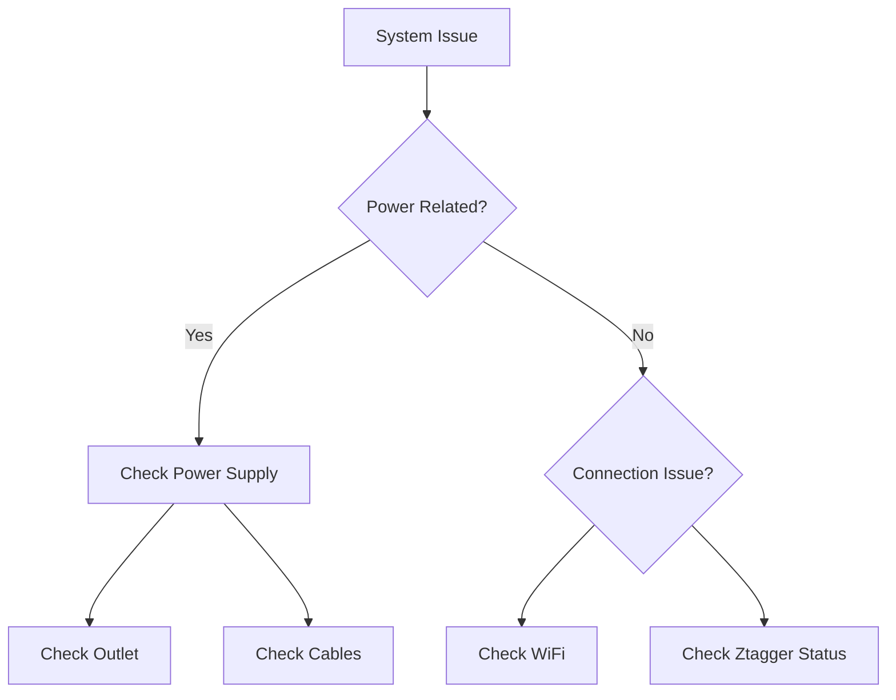
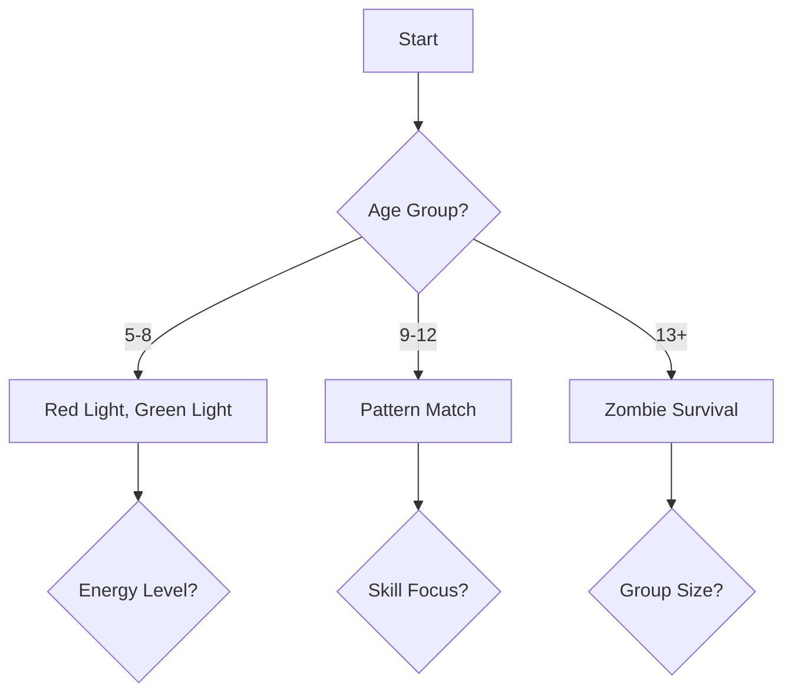

# ZTAG Knowledge Base

## Quick Reference Index
[🔧 System Components](#system-components) | 
[🚀 Quick Start](#quick-start-guide) | 
[🎮 Games](#game-modes) | 
[🛡️ Safety](#safety-guidelines) | 
[📋 ASP](#annual-service-plan-asp) | 
[⚙️ Setup](#setup-and-operation) | 
[🔨 Maintenance](#maintenance-and-service) | 
[❓ Support](#support-and-troubleshooting) | 
[💰 Pricing](#pricing-and-purchase-information)

## Table of Contents
1. [Introduction](#introduction)
   - Company Overview
   - About ZTAG
   - Core Values
   - Core Focus

2. [System Components](#system-components)
   - ZEUS Command Center
   - Ztagger Pro Units
   - System Requirements
   - Key Features

3. [Quick Start Guide](#quick-start-guide)
   - Initial Setup
   - Basic Operation
   - First Game Setup
   - Common Commands

4. [Game Modes](#game-modes)
   - Red Light, Green Light
   - Pattern Match
   - Zombie Survival
   - Rock, Paper, Scissors
   - Math Match
   - Keep Away

5. [Setup and Operation](#setup-and-operation)
   - Basic Setup Requirements
   - Setup Process
   - Ztagger Fitting Guide

6. [Event Management](#event-management)
   - Small Events (≤24 players)
   - Large Events (>24 players)

7. [Safety Guidelines](#safety-guidelines)
   - Clear play area of obstacles
   - Set clear boundaries
   - Wear appropriate footwear
   - Stay aware of other players
   - Follow game-specific safety rules

8. [Annual Service Plan (ASP)](#annual-service-plan-asp)
   - Overview
   - Cost and Coverage
   - Hardware Coverage
   - Software Benefits
   - Support Services

9. [Maintenance and Service](#maintenance-and-service)
   - Cleaning Instructions
   - Charging Guidelines
   - Troubleshooting Hardware Issues

10. [Support and Troubleshooting](#support-and-troubleshooting)
    - Contact Information
    - Support Hours
    - Escalation Process
    - Troubleshooting Templates

11. [Pricing and Purchase Information](#pricing-and-purchase-information)
    - System Components Pricing
    - Warranty Information
    - Annual Service Plan (ASP)
    - Additional Services
    - How to Purchase

12. [FAQs and Troubleshooting](#faqs-and-troubleshooting)
    - Frequently Asked Questions
    - Common Issues Index
    - Quick Solutions Guide

13. [Visual Guides and Resources](#visual-guides-and-resources)
    - Setup Diagrams
    - Checklists and Templates
    - Video Tutorial Links

14. [Support Resources](#support-resources)
    - Contact Information
    - Support Hours
    - Escalation Process

15. [Appendices](#appendices)
    - Technical Specifications
    - Glossary of Terms
    - Safety and Compliance
    - Version History

16. [Interactive Decision Tools](#interactive-decision-tools)
    - Event Planning Calculator
    - Space Requirements Calculator

17. [Role-Specific Guides](#role-specific-guides)
    - For Teachers and Educators
    - For Event Planners
    - For Technical Staff

18. [Enhanced Templates and Checklists](#enhanced-templates-and-checklists)
    - Pre-Event Checklist
    - Post-Event Report Template
    - Game Selection Flowchart

19. [Interactive Training Modules](#interactive-training-modules)
    - New Operator Training
    - Maintenance Training

## Introduction

### Company Overview

### Core Values
1. **Playful Innovation**: Embrace creativity and fun in developing innovative solutions
2. **Active Learning**: Promote continuous learning through engaging, hands-on experiences
3. **Collaborative Spirit**: Foster teamwork and open communication
4. **Tech-Enhanced Connections**: Leverage technology to enhance real-world interactions
5. **Continuous Growth**: Commit to personal, professional, and organizational development
6. **Inclusivity**: Ensure products and experiences are accessible to all

### Core Focus
- **Purpose**: Transform out-of-school experiences into opportunities for inclusive growth and joy
- **Niche**: Creating tech-enhanced, active play systems that make learning irresistibly fun and inclusive

## System Components

### ZTAG Unified Entertainment System (ZUES)
- Central computer with touch display
- Built-in wireless router
- Charging slots for 24 ztaggers
- Portable design (18" roll-on suitcase)
- Weight: approximately 40 pounds when fully loaded

### Ztaggers (Wearable Game Trackers)
- Individual screen display
- Built-in speaker
- Vibration motor
- Motion sensor
- Infrared emitter
- Proximity detector
- Adjustable wristband for all sizes

## Game Modes

### 1. Red Light, Green Light
**Game Type**: Movement-based
**Players**: 1-24
**Difficulty**: Easy

**How to Play**:
1. Players wear ztaggers on their wrists
2. When the screen shows GREEN, players move freely
3. When the screen shows RED, players must freeze
4. Movement during RED light eliminates players
5. Players earn points by moving during GREEN light
6. Last player standing or highest score wins

**Tips for Success**:
- Keep an eye on your ztagger screen
- Make larger movements during GREEN light for more points
- Stay completely still during RED light
- Listen for audio cues that signal light changes

### 2. Pattern Match
**Game Type**: Memory and Movement
**Players**: 2-24
**Difficulty**: Medium

**How to Play**:
1. Some players receive patterns on their ztaggers
2. Other ztaggers display matching answers
3. Players must find their matching pair
4. When two matching ztaggers are brought together, both score points
5. Continue matching until time runs out

**Strategy Guide**:
- Memorize your pattern
- Scan the room efficiently
- Communicate with other players
- Check multiple potential matches quickly

### 3. Zombie Survival
**Game Type**: Team-based Tag
**Players**: 4-24
**Difficulty**: Medium

**How to Play**:
1. One player starts as the zombie
2. Zombie must tag (infect) other players
3. Tagged players become zombies
4. Humans try to survive uninfected
5. Game ends when all players are zombies or time runs out

**Winning Conditions**:
- Zombies win: All players converted
- Humans win: At least one survivor when time expires

**Tips**:
- Zombies: Coordinate with other zombies to corner humans
- Humans: Stay moving, avoid getting cornered
- Use the environment strategically

### 4. Rock, Paper, Scissors
**Game Type**: Active Strategy
**Players**: 3-24
**Difficulty**: Easy

**How to Play**:
1. Players are divided into three teams (Rock, Paper, Scissors)
2. Teams are color-coded (Red=Rock, Green=Paper, Blue=Scissors)
3. Players tag opponents following traditional rules:
   - Rock crushes Scissors
   - Scissors cuts Paper
   - Paper covers Rock
4. Tagged players join the winning team
5. Game ends when one team converts all players

**Strategy Tips**:
- Stay with your team for protection
- Target vulnerable opponents
- Watch for team size changes
- Use the space wisely

### 5. Math Match
**Game Type**: Educational Active Learning
**Players**: 2-24
**Difficulty**: Medium

**How to Play**:
1. Players receive either math problems or answers on their ztaggers
2. Move around to find matching problem/solution pairs
3. When correct pairs meet, both score points
4. Continue solving until time expires

**Educational Benefits**:
- Mental math practice
- Physical activity
- Problem-solving skills
- Social interaction

**Teaching Tips**:
- Adjust difficulty based on grade level
- Mix ability levels for peer learning
- Use as review activity
- Track progress over multiple games

### 6. Keep Away
**Game Type**: Evasion
**Players**: 4-24
**Difficulty**: Medium

**How to Play**:
1. One or more players are designated as "It"
2. Other players must avoid being tagged
3. Tagged players join the "It" team
4. Last player(s) avoiding capture wins
5. Time limit adds urgency

**Game Variations**:
1. **Speed Round**: Shorter time limit
2. **Multiple Taggers**: Start with more "It" players
3. **Safe Zones**: Designate temporary safety areas
4. **Point System**: Award points for duration of evasion

**Safety Guidelines for All Games**:
1. Clear play area of obstacles
2. Set clear boundaries
3. Wear appropriate footwear
4. Stay aware of other players
5. Follow game-specific safety rules

## Pricing and Purchase Information

### System Components Pricing
1. **ZEUS Command Center**
   - Standard Retail Price: $3,700
   - Includes built-in touchscreen computer and wireless router
   - Charging slots for 24 ztaggers

2. **Ztagger Pro Units**
   - Standard Retail Price: $300 each
   - Wearable game trackers with screen, speaker, and sensors

### Warranty Information
1. **Extended Manufacturer's Warranty**
   - One-year coverage for manufacturer defects
   - Free replacement for defective units
   - Excludes normal wear and tear

2. **First-Year Benefits**
   - Complimentary 12-month Annual Service Plan
   - Included with all new purchases
   - Optional renewal after first year

### Annual Service Plan (ASP)
- Cost: $930 per system per year

#### ASP Benefits:

1. **Ztagger Pro Coverage**
   - Up to 6 replacements per year at $75 each
   - Additional replacements at $200 each
   - $100 discount off retail price for extra units

2. **Command Center Coverage**
   - One replacement per year at $2,300
   - Additional replacements at $2,300 each
   - $1,400 discount off retail price

3. **Software Benefits**
   - New software library releases included
   - Firmware upgrades at no additional cost
   - Regular updates and improvements

### Additional Services
- Software Library/Firmware Upgrades: Starting at $1,000
- Custom game development available
- Training and support packages

### How to Purchase
Contact ZTAG directly for:
- New system quotes
- ASP enrollment
- Replacement requests
- Custom solutions

*Note: Pricing is specific to Educational, Government, and Non-Profit Institutions. Contact ZTAG for commercial pricing.*

## Setup and Operation

### Basic Setup Requirements
- Two 6-foot folding tables
- Power source (minimum 300W for remote locations)
- Extension cord with carpet cable covers
- Optional: ZTAG branded tablecloths

### Setup Process
1. Position tables within power source range
2. Place ZEUS on primary table
3. Arrange ztaggers on secondary table for easy distribution
4. Connect power and boot up system
5. Test wireless connectivity
6. Distribute ztaggers to players

### Ztagger Fitting Guide
**Standard Fitting**
1. Thread hook end through plastic buckle
2. Pull hook side over loop side
3. Adjust for comfort

**Small Wrist Fitting**
1. Fold over excess hook end
2. Attach to logo end of band
3. Ensure secure fit

## Event Management

### Small Events (≤24 players)
- Direct distribution of all ztaggers
- Continuous play possible
- Rotate through game modes for variety

### Large Events (>24 players)
- Implement rotation system
- 10-minute game sessions
- Can handle up to 100 players per hour
- Use external display for score tracking

## Troubleshooting

### Common Issues and Solutions

#### Firmware Updates
If firmware isn't visible in ZEUS:
1. Check WiFi connection
2. Verify system is online
3. Restart ZEUS if necessary

#### Ztagger Connection Issues
1. Ensure proper charging contact
2. Check battery level
3. Reset device if necessary

#### System Reset Process
1. Access Settings menu
2. Select Devices
3. Use Reset Devices function
4. Wait for white blinking confirmation
5. Verify new assignments

## Best Practices

### Game Operation
1. Start with simpler games for new groups
2. Gradually increase complexity
3. Mix physical and cognitive games
4. Allow brief rest periods between rounds

### Equipment Care
1. Regular charging after events
2. Clean equipment between uses
3. Store in cool, dry location
4. Perform regular system checks

### Safety Guidelines
1. Clear play area of obstacles
2. Establish boundaries
3. Brief players on safe movement
4. Monitor physical exertion levels

## Maintenance and Service

### Annual Service Plan (ASP)

#### Overview
The Annual Service Plan (ASP) provides comprehensive coverage and support for your ZTAG system. All new purchases include a complimentary 12-month ASP, with the option to renew annually.

#### Cost and Coverage
- Annual Cost: $930 per system
- Coverage Period: 12 months
- Renewal: Available yearly
- First Year: Included with new system purchase

#### Hardware Coverage

#### ZEUS Command Center Coverage
- One replacement unit per year at $2,300 (Retail: $3,700)
- Additional replacements available at manufacturer's specified rate
- Includes support for hardware and software issues

#### Ztagger Pro Coverage
- Up to 6 replacements per year at $75 each (Retail: $300)
- Additional replacements available at $200 each
- $100 discount off retail price for extra units
- Coverage includes:
  * Screen issues
  * Battery problems
  * Sensor malfunctions
  * Connection failures

#### Software Benefits
- All new software library releases
- Regular firmware upgrades
- System updates and improvements
- Priority access to new features
- Bug fixes and patches

#### Support Services
- Priority technical support
- Extended support hours
- Faster response times
- Remote diagnostics
- Training resources

#### How to Use ASP

#### Making a Claim
1. Contact support via:
   - Email: support@ztag.com
   - Phone: [Support Number]
   - Support Portal: [Portal URL]
2. Provide:
   - System serial number
   - ASP contract number
   - Issue description
   - Photos/videos (if applicable)

#### Replacement Process
1. Submit replacement request
2. Receive approval
3. Receive replacement unit
4. Return defective unit (if required)
5. Install and test new unit

#### ASP Renewal
- Renewal notification sent 60 days before expiration
- Early renewal discounts available
- Multi-year options available
- No coverage gap if renewed before expiration

#### What's Not Covered
- Intentional damage
- Unauthorized modifications
- Lost or stolen equipment
- Cosmetic damage
- Third-party accessories
- Environmental damage (flood, lightning)

#### ASP Status Check
To verify your ASP status:
1. Log into [Customer Portal]
2. Check system dashboard
3. View coverage details
4. Review claim history

#### Additional Benefits
- Training sessions
- Documentation updates
- Configuration assistance
- Event support
- System optimization

#### Questions?
Contact our ASP team:
- Email: help@ztag.com
- Phone: [ASP Support Number]
- Hours: Monday-Friday, 9 AM - 5 PM EST

#### Cleaning Instructions
- Use lint-free microfiber cloth for cleaning ztaggers
- Do not use solvents on any components
- Keep charging knobs free of debris to prevent damage to charging pins
- Ensure wristbands are tucked behind units when in charging dock

#### Charging Guidelines
1. **ZEUS Case Handling**
   - Exercise caution when lid is open due to screen weight
   - Keep case stable during charging operations
   - Ensure proper ventilation around charging dock

2. **Ztagger Charging**
   - Place ztaggers firmly in charging bays
   - Verify charging status via screen indicator
   - Note: Ztaggers power off automatically when removed from charging dock
   - Monitor battery levels (minimum two cells required for operation)

## Quick Start Guides

### First-Time Setup
1. **Unboxing Checklist**
   - [ ] ZEUS case with all components
   - [ ] Power cables and surge protector
   - [ ] Tables and setup materials
   - [ ] Network connectivity equipment

2. **30-Minute Setup Guide**
   - Step 1: Position and power ZEUS (5 min)
   - Step 2: System boot and verification (5 min)
   - Step 3: Ztagger distribution setup (10 min)
   - Step 4: Test run with sample game (10 min)

### Common User Scenarios

#### For Event Organizers
- Quick event setup checklist
- Space requirements calculator
- Player rotation templates
- Event timeline templates

#### For IT Administrators
- Network setup guide
- System integration steps
- Backup procedures
- Software update protocol

#### For Game Facilitators
- Pre-game briefing script
- Game selection flowchart
- Player engagement tips
- Post-game review process

## FAQs and Troubleshooting

### Frequently Asked Questions

#### General Questions
Q: How long does it take to set up ZTAG for an event?
A: Basic setup takes approximately 30 minutes, including system boot and verification.

Q: How many players can participate simultaneously?
A: The standard system supports 24 players, expandable to 48 with additional ztaggers.

#### Technical Questions
Q: What power requirements does ZEUS need?
A: Standard 110V outlet with surge protection; minimum 300W for remote locations.

Q: How long do ztagger batteries last?
A: Fully charged ztaggers last approximately 8 hours of continuous play.

#### Event Management
Q: How do I handle more players than available ztaggers?
A: Implement a rotation system with 10-minute game sessions, supporting up to 100 players per hour.

Q: What's the recommended staff ratio for events?
A: 1 facilitator per 24 players, with additional support for larger groups.

### Common Issues Index

#### Quick Solutions Guide
1. **System Won't Start**
   - Power connection check
   - Boot sequence steps
   - Emergency restart procedure

2. **Ztagger Connection Issues**
   - Signal strength verification
   - Battery level check
   - Reset procedures

3. **Game Performance Problems**
   - Space optimization tips
   - Interference troubleshooting
   - Player positioning guide

## Visual Guides and Resources

### Setup Diagrams
- Optimal ZEUS placement
- Ztagger wearing guide
- Play area layout examples

### Checklists and Templates
- Event planning checklist
- Maintenance schedule
- Incident report form
- Performance tracking sheet

### Video Tutorial Links
- System setup walkthrough
- Game mode demonstrations
- Troubleshooting guides
- Best practices showcase

## Support Resources

### Contact Information
- Technical Support: [Contact Details]
- Customer Service: [Contact Details]
- Emergency Support: [Contact Details]

### Support Hours
- Regular Support: Monday-Friday, 9 AM - 5 PM EST
- Emergency Support: 24/7 for critical issues
- Holiday Schedule: [Link to Schedule]

### Escalation Process
1. Check knowledge base
2. Submit support ticket
3. Schedule video call
4. On-site support request

## Appendices

### Technical Specifications
- Power requirements
- Network specifications
- Space requirements
- Environmental conditions

### Glossary of Terms
- Technical terminology
- Game-specific terms
- System components
- Common abbreviations

### Safety and Compliance
- Safety guidelines
- Regulatory compliance
- Insurance requirements
- Liability information

### Version History
- System updates log
- Document revision history
- Feature additions
- Bug fix records

## Interactive Decision Tools

### Event Planning Calculator
```javascript
// Embed this calculator on the website
function calculateEventNeeds(playerCount, duration) {
    const rotationTime = 10; // minutes
    const maxPlayersPerSession = 24;
    return {
        sessions: Math.ceil(playerCount / maxPlayersPerSession),
        totalTime: Math.ceil(playerCount / maxPlayersPerSession) * rotationTime,
        staffNeeded: Math.ceil(playerCount / 24)
    };
}
```

### Space Requirements Calculator
```javascript
// Embed this calculator on the website
function calculateSpaceNeeds(playerCount, gameType) {
    const spacePerPlayer = {
        'redlight': 15, // sq ft
        'zombie': 20,
        'pattern': 10,
        'math': 15
    };
    return spacePerPlayer[gameType] * playerCount;
}
```

## Role-Specific Guides

### For Teachers and Educators

#### Curriculum Integration
- **STEM Learning Objectives**
  - Mathematics through Math Match mode
  - Physics concepts in movement games
  - Pattern recognition and cognitive development
  - Data analysis using game statistics

#### Lesson Plan Templates
1. **30-Minute Physical Education Session**
   - 5min: Equipment setup
   - 5min: Rules explanation
   - 15min: Active gameplay
   - 5min: Cool-down and discussion

2. **45-Minute STEM Lesson**
   - 10min: Concept introduction
   - 25min: ZTAG activity
   - 10min: Data analysis and discussion

### For Event Planners

#### Event Type Templates

1. **Birthday Party Package**
   ```markdown
   Duration: 2 hours
   Setup: 30 minutes before
   Players: Up to 24
   
   Schedule:
   - 00:00-00:15 Welcome and rules
   - 00:15-00:45 Game Session 1
   - 00:45-01:00 Break
   - 01:00-01:30 Game Session 2
   - 01:30-02:00 Awards and wrap-up
   ```

2. **Corporate Team Building**
   ```markdown
   Duration: 4 hours
   Players: Up to 48 (rotating)
   
   Schedule:
   - 00:00-00:30 Introduction
   - 00:30-01:30 Skill-building games
   - 01:30-02:00 Break
   - 02:00-03:30 Team challenges
   - 03:30-04:00 Debrief
   ```

### For Technical Staff

#### System Maintenance Schedule
```markdown
Daily Tasks:
- [ ] Battery level check
- [ ] Ztagger cleaning
- [ ] Connection verification

Weekly Tasks:
- [ ] Software updates
- [ ] Deep cleaning
- [ ] Performance analytics review

Monthly Tasks:
- [ ] Hardware inspection
- [ ] Network optimization
- [ ] Backup system check
```

#### Troubleshooting Decision Tree


## Enhanced Templates and Checklists

### Pre-Event Checklist
```markdown
Equipment Preparation:
- [ ] ZEUS system charged (100%)
- [ ] All ztaggers charged (100%)
- [ ] Spare power banks ready
- [ ] Network equipment tested
- [ ] Backup system verified

Venue Setup:
- [ ] Power source located
- [ ] Play area measured
- [ ] Safety hazards removed
- [ ] Network coverage tested
- [ ] Emergency exits identified

Staff Preparation:
- [ ] Roles assigned
- [ ] Communication devices ready
- [ ] Emergency procedures reviewed
- [ ] Contact list updated
- [ ] First aid kit checked
```

### Post-Event Report Template
```markdown
Event Details:
- Date: [Date]
- Location: [Location]
- Number of Players: [Count]
- Duration: [Hours]

Performance Metrics:
- Total Games Played: [Count]
- Average Game Duration: [Minutes]
- Peak Concurrent Players: [Count]
- System Uptime: [Percentage]

Issues Encountered:
1. [Issue Description]
   - Impact: [High/Medium/Low]
   - Resolution: [Steps Taken]
   - Prevention Plan: [Future Steps]

Player Feedback:
- Positive Points: [List]
- Areas for Improvement: [List]
- Suggestions: [List]

Equipment Status:
- ZEUS Performance: [Notes]
- Ztagger Issues: [Count and Description]
- Maintenance Needed: [List]
```

### Game Selection Flowchart


## Interactive Training Modules

### New Operator Training
1. **Basic Operations (Day 1)**
   - System Overview
   - Safety Procedures
   - Basic Game Management
   
2. **Advanced Features (Day 2)**
   - Custom Game Creation
   - Event Management
   - Troubleshooting

3. **Certification Checklist**
   ```markdown
   Basic Skills:
   - [ ] Power up/down sequence
   - [ ] Ztagger distribution
   - [ ] Game initiation
   - [ ] Basic troubleshooting
   
   Advanced Skills:
   - [ ] Custom game setup
   - [ ] Network configuration
   - [ ] Event management
   - [ ] Emergency procedures
   ```

### Maintenance Training
1. **Daily Procedures**
   - Equipment inspection guide
   - Cleaning protocols
   - Storage requirements

2. **Weekly Maintenance**
   - Deep cleaning procedures
   - Software update process
   - Performance optimization

3. **Monthly Maintenance**
   - Hardware inspection
   - Network optimization
   - Backup system check

*This knowledge base is actively maintained and updated. Last revision: [Date]*
*For urgent issues not covered here, please contact our support team.*
*Feedback? Help us improve this document by submitting suggestions through our feedback form.*
